# AWS ARCHITECTURE DIAGRAM
## Hate Speech Detection Platform - Visual Architecture

**Project:** Mappa dell'Intolleranza 2024  
**Architecture:** Production-ready AWS cloud infrastructure  
**Scale:** 194,499+ records, 6 hate speech categories, Multi-source ingestion

---

## HIGH-LEVEL ARCHITECTURE OVERVIEW

---

## DETAILED DATA FLOW ARCHITECTURE

```mermaid
flowchart TD
    subgraph "External Data Sources"
        DS1[Twitter API v2]
        DS2[Facebook Graph API]
        DS3[Instagram Basic Display]
        DS4[TikTok Research API]
        DS5[Manual File Uploads]
    end
    
    subgraph "Data Ingestion & Streaming"
        KDS[Amazon Kinesis Data Streams<br/>📊 Real-time streaming<br/>10 shards, 24h retention]
        SQS[Amazon SQS<br/>📬 Message queuing<br/>Standard + DLQ]
        EB[Amazon EventBridge<br/>⚡ Event routing<br/>Custom event buses]
    end
    
    subgraph "Serverless Processing"
        L1[AWS Lambda<br/>⚡ Data validation<br/>Python 3.11, 3GB RAM]
        L2[AWS Lambda<br/>⚡ Real-time classification<br/>15min timeout]
        L3[AWS Lambda<br/>⚡ Notification service<br/>SNS integration]
    end
    
    subgraph "Containerized Processing"
        ECS[Amazon ECS with Fargate<br/>🐳 Data preprocessing<br/>Auto-scaling containers]
        EMR[Amazon EMR<br/>📊 Spark cluster<br/>Big data processing]
    end
    
    subgraph "AI/ML Services"
        SM[Amazon SageMaker<br/>🤖 Model training & deployment<br/>GPT-4o, Gemini, BERT]
        BR[Amazon Bedrock<br/>🧠 Foundation models<br/>Claude, Titan, Jurassic-2]
        COMP[Amazon Comprehend<br/>📝 NLP services<br/>Sentiment, entities, custom models]
    end
    
    subgraph "Data Storage"
        S3[Amazon S3 Data Lake<br/>🗄️ Raw + processed data<br/>Lifecycle policies, versioning]
        RDS[Amazon RDS PostgreSQL<br/>🗃️ Structured data<br/>Multi-AZ, read replicas]
        DDB[Amazon DynamoDB<br/>⚡ NoSQL real-time<br/>On-demand, GSI]
        OS[Amazon OpenSearch<br/>🔍 Full-text search<br/>3-node cluster]
    end
    
    subgraph "Analytics & BI"
        QS[Amazon QuickSight<br/>📈 Interactive dashboards<br/>Real-time visualization]
        ATH[Amazon Athena<br/>🔍 Serverless SQL<br/>S3 data queries]
        GLUE[AWS Glue<br/>🔧 ETL operations<br/>Crawlers, jobs, catalog]
    end
    
    subgraph "API & Presentation"
        API[Amazon API Gateway<br/>🌐 RESTful APIs<br/>Rate limiting, auth]
        CF[Amazon CloudFront<br/>🌍 CDN distribution<br/>Global edge locations]
        WEB[S3 Static Website<br/>💻 React.js frontend<br/>SPA hosting]
    end
    
    subgraph "Security & Monitoring"
        IAM[AWS IAM<br/>🔐 Identity management<br/>Roles, policies, MFA]
        CW[Amazon CloudWatch<br/>📊 Monitoring & logging<br/>Metrics, alarms, dashboards]
        CT[AWS CloudTrail<br/>📋 API audit logging<br/>Compliance tracking]
    end
    
    %% Data Flow Connections
    DS1 --> KDS
    DS2 --> KDS
    DS3 --> KDS
    DS4 --> KDS
    DS5 --> SQS
    
    KDS --> L1
    SQS --> L1
    EB --> L1
    
    L1 --> L2
    L1 --> ECS
    L2 --> SM
    ECS --> EMR
    
    SM --> BR
    SM --> COMP
    BR --> S3
    COMP --> S3
    
    L2 --> RDS
    ECS --> DDB
    EMR --> OS
    
    S3 --> ATH
    RDS --> QS
    DDB --> QS
    OS --> QS
    
    ATH --> GLUE
    GLUE --> S3
    
    QS --> API
    API --> CF
    CF --> WEB
    
    %% Security connections
    IAM -.-> L1
    IAM -.-> ECS
    IAM -.-> SM
    IAM -.-> S3
    IAM -.-> RDS
    
    CW -.-> L1
    CW -.-> ECS
    CW -.-> SM
    CW -.-> S3
    
    CT -.-> API
    CT -.-> S3
    CT -.-> RDS
```

---

## DATA PIPELINE ARCHITECTURE

---

## SECURITY ARCHITECTURE

```mermaid
graph TB
    subgraph "Identity & Access Management"
        IAM[AWS IAM<br/>🔐 User & Role Management]
        MFA[Multi-Factor Authentication<br/>📱 MFA Enforcement]
        RBAC[Role-Based Access Control<br/>👥 Least Privilege]
    end
    
    subgraph "Network Security"
        VPC[Amazon VPC<br/>🌐 Private Network]
        SG[Security Groups<br/>🛡️ Firewall Rules]
        NACL[Network ACLs<br/>🔒 Subnet Protection]
        WAF[AWS WAF<br/>🛡️ Web Application Firewall]
    end
    
    subgraph "Data Security"
        KMS[AWS KMS<br/>🔑 Key Management]
        SSE[Server-Side Encryption<br/>🔐 Data at Rest]
        TLS[Transport Layer Security<br/>🔒 Data in Transit]
        DLP[Data Loss Prevention<br/>🚫 PII Protection]
    end
    
    subgraph "Monitoring & Compliance"
        CT[CloudTrail<br/>📋 API Audit Logs]
        CW[CloudWatch<br/>📊 Security Monitoring]
        GUARD[GuardDuty<br/>🕵️ Threat Detection]
        CONFIG[AWS Config<br/>⚙️ Compliance Monitoring]
    end
    
    IAM --> VPC
    MFA --> IAM
    RBAC --> IAM
    
    VPC --> SG
    SG --> NACL
    WAF --> VPC
    
    KMS --> SSE
    SSE --> TLS
    TLS --> DLP
    
    CT --> CW
    CW --> GUARD
    GUARD --> CONFIG
```

---

## COST OPTIMIZATION ARCHITECTURE

```mermaid
graph TB
    subgraph "Compute Optimization"
        SPOT[Spot Instances<br/>💰 50-70% savings]
        RESERVED[Reserved Instances<br/>💰 30-50% savings]
        AUTO[Auto Scaling<br/>📈 Demand-based scaling]
        SERVERLESS[Serverless<br/>⚡ Pay-per-use]
    end
    
    subgraph "Storage Optimization"
        LIFECYCLE[S3 Lifecycle Policies<br/>📦 Automatic tiering]
        COMPRESS[Data Compression<br/>🗜️ Parquet format]
        DEDUP[Deduplication<br/>🔄 Remove duplicates]
        ARCHIVE[Glacier Archive<br/>🏔️ Long-term storage]
    end
    
    subgraph "Database Optimization"
        READREP[Read Replicas<br/>📖 Read scaling]
        POOL[Connection Pooling<br/>🔗 Reduce connections]
        INDEX[Query Optimization<br/>⚡ Proper indexing]
        MONITOR[Performance Monitoring<br/>📊 Slow query detection]
    end
    
    subgraph "Monitoring & Alerts"
        BUDGET[AWS Budgets<br/>💰 Cost tracking]
        ALERTS[Cost Alerts<br/>🚨 Threshold notifications]
        RECOMMEND[Cost Explorer<br/>💡 Optimization suggestions]
        TAGS[Resource Tagging<br/>🏷️ Cost allocation]
    end
    
    SPOT --> AUTO
    RESERVED --> AUTO
    AUTO --> SERVERLESS
    
    LIFECYCLE --> COMPRESS
    COMPRESS --> DEDUP
    DEDUP --> ARCHIVE
    
    READREP --> POOL
    POOL --> INDEX
    INDEX --> MONITOR
    
    BUDGET --> ALERTS
    ALERTS --> RECOMMEND
    RECOMMEND --> TAGS
```

---

## DISASTER RECOVERY ARCHITECTURE

```mermaid
graph TB
    subgraph "Primary Region (us-east-1)"
        P_S3[Primary S3 Bucket]
        P_RDS[Primary RDS Instance]
        P_LAMBDA[Primary Lambda Functions]
        P_ECS[Primary ECS Cluster]
    end
    
    subgraph "Secondary Region (us-west-2)"
        S_S3[Secondary S3 Bucket]
        S_RDS[Secondary RDS Read Replica]
        S_LAMBDA[Secondary Lambda Functions]
        S_ECS[Secondary ECS Cluster]
    end
    
    subgraph "Backup & Recovery"
        BACKUP[Automated Backups<br/>📦 Daily snapshots]
        REPLICATION[Cross-Region Replication<br/>🔄 Real-time sync]
        SNAPSHOT[Point-in-Time Recovery<br/>⏰ 30-day retention]
        FAILOVER[Automated Failover<br/>🔄 RTO: 4 hours]
    end
    
    subgraph "Monitoring & Testing"
        HEALTH[Health Checks<br/>💓 Service monitoring]
        DRILL[DR Drills<br/>🧪 Monthly testing]
        ALERT[Failover Alerts<br/>🚨 Notification system]
        METRICS[Recovery Metrics<br/>📊 RTO/RPO tracking]
    end
    
    P_S3 --> REPLICATION
    REPLICATION --> S_S3
    
    P_RDS --> BACKUP
    BACKUP --> SNAPSHOT
    SNAPSHOT --> S_RDS
    
    P_LAMBDA --> FAILOVER
    P_ECS --> FAILOVER
    FAILOVER --> S_LAMBDA
    FAILOVER --> S_ECS
    
    HEALTH --> DRILL
    DRILL --> ALERT
    ALERT --> METRICS
```

---

## PERFORMANCE MONITORING ARCHITECTURE

```mermaid
graph TB
    subgraph "Application Monitoring"
        XRAY[AWS X-Ray<br/>🔍 Distributed tracing]
        CW_LOGS[CloudWatch Logs<br/>📝 Centralized logging]
        CUSTOM[Custom Metrics<br/>📊 Business metrics]
        HEALTH[Health Checks<br/>💓 Service health]
    end
    
    subgraph "Infrastructure Monitoring"
        CW_METRICS[CloudWatch Metrics<br/>📈 System performance]
        INSIGHTS[Application Insights<br/>🔬 Code-level monitoring]
        SYNTHETIC[Synthetic Monitoring<br/>🤖 User experience]
        RUM[Real User Monitoring<br/>👥 Actual user performance]
    end
    
    subgraph "Alerting & Notifications"
        SNS[SNS Topics<br/>📢 Alert distribution]
        EMAIL[Email Notifications<br/>📧 Critical alerts]
        SLACK[Slack Integration<br/>💬 Team notifications]
        PAGER[PagerDuty<br/>📞 On-call management]
    end
    
    subgraph "Dashboards & Reporting"
        DASHBOARD[CloudWatch Dashboards<br/>📊 Real-time views]
        REPORTS[Performance Reports<br/>📋 Regular reports]
        TRENDS[Trend Analysis<br/>📈 Historical data]
        CAPACITY[Capacity Planning<br/>📏 Resource forecasting]
    end
    
    XRAY --> CW_LOGS
    CW_LOGS --> CUSTOM
    CUSTOM --> HEALTH
    
    CW_METRICS --> INSIGHTS
    INSIGHTS --> SYNTHETIC
    SYNTHETIC --> RUM
    
    HEALTH --> SNS
    RUM --> SNS
    SNS --> EMAIL
    EMAIL --> SLACK
    SLACK --> PAGER
    
    CW_METRICS --> DASHBOARD
    DASHBOARD --> REPORTS
    REPORTS --> TRENDS
    TRENDS --> CAPACITY
```

---

## IMPLEMENTATION PHASES

---

## ESTIMATED COSTS BREAKDOWN

---

## KEY ARCHITECTURE DECISIONS

### **1. Multi-Tier Architecture**
- **Separation of concerns** with distinct layers
- **Scalability** through independent scaling
- **Maintainability** with clear boundaries

### **2. Serverless-First Approach**
- **Cost efficiency** with pay-per-use model
- **Automatic scaling** without manual intervention
- **Reduced operational overhead**

### **3. Data Lake + Data Warehouse**
- **Flexibility** with S3 data lake
- **Performance** with PostgreSQL warehouse
- **Cost optimization** with appropriate storage tiers

### **4. Event-Driven Architecture**
- **Real-time processing** with event streams
- **Loose coupling** between components
- **Resilience** with retry mechanisms

### **5. Security by Design**
- **Defense in depth** with multiple security layers
- **Least privilege** access principles
- **Compliance** with data protection regulations

---

**Architecture Diagram Generated:** December 2024  
**Total AWS Services:** 25+ services  
**Architecture Type:** Production-ready, scalable cloud infrastructure  
**Target Environment:** Multi-region, high-availability deployment
