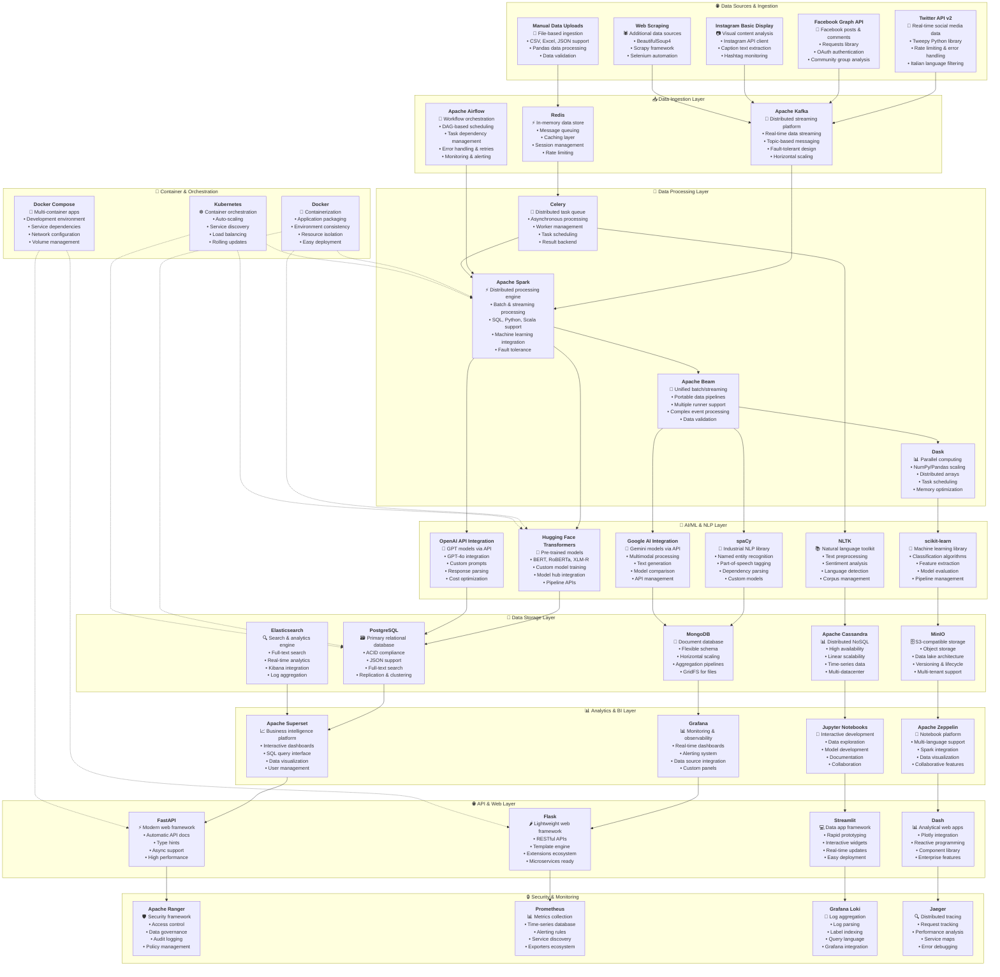

# 🚀 Open-Source Data Engineering Architecture
## Hate Speech Detection Platform - Complete Open-Source Solution

**Project:** Mappa dell'Intolleranza 2024  
**Architecture:** Open-Source Data Engineering Stack  
**Approach:** End-to-End Open-Source Data Pipeline  

---

## 🏗️ Complete Open-Source Architecture Diagram

---

## 🔄 Data Pipeline Flow Diagram

```mermaid
flowchart LR
    subgraph "📥 Data Ingestion Pipeline"
        A1["`**Social Media APIs**
        📱 Twitter, Facebook, Instagram
        • Real-time data collection
        • Rate limiting & error handling`"] --> B1["`**Apache Kafka**
        🌊 Message streaming
        • Topic partitioning
        • Fault tolerance`"]
        A2["`**File Uploads**
        📁 CSV, Excel, JSON
        • Batch processing
        • Data validation`"] --> B2["`**Redis Queue**
        ⚡ Task queuing
        • Priority handling
        • Retry mechanisms`"]
        A3["`**Web Scraping**
        🕷️ Additional sources
        • Scheduled collection
        • Content extraction`"] --> B3["`**Apache Airflow**
        🔄 Workflow orchestration
        • DAG scheduling
        • Dependency management`"]
    end
    
    subgraph "🔄 Data Processing Pipeline"
        B1 --> C1["`**Apache Spark**
        ⚡ Stream processing
        • Real-time classification
        • Data transformation`"]
        B2 --> C2["`**Celery Workers**
        🐍 Async processing
        • Task distribution
        • Result collection`"]
        B3 --> C3["`**Apache Beam**
        🌊 Batch processing
        • ETL operations
        • Data validation`"]
        C1 --> C4["`**Data Quality Checks**
        ✅ Validation pipeline
        • Completeness checks
        • Accuracy validation
        • Consistency monitoring`"]
        C2 --> C4
        C3 --> C4
    end
    
    subgraph "🤖 AI/ML Processing Pipeline"
        C4 --> D1["`**Text Preprocessing**
        📝 NLP pipeline
        • Tokenization
        • Cleaning & normalization
        • Feature extraction`"]
        D1 --> D2["`**Model Ensemble**
        🧠 Multi-model voting
        • BERT classification
        • GPT-4o analysis
        • Gemini processing
        • Confidence scoring`"]
        D2 --> D3["`**Result Aggregation**
        📊 Ensemble voting
        • Weighted scoring
        • Consensus building
        • Quality assessment`"]
    end
    
    subgraph "💾 Data Storage Pipeline"
        D3 --> E1["`**PostgreSQL**
        🗃️ Structured data
        • Classification results
        • User management
        • Audit logs`"]
        D3 --> E2["`**MongoDB**
        🍃 Document storage
        • Raw posts
        • Metadata
        • Analytics data`"]
        D3 --> E3["`**MinIO**
        🗄️ Object storage
        • File backups
        • Model artifacts
        • Data lake`"]
        D3 --> E4["`**Elasticsearch**
        🔍 Search index
        • Full-text search
        • Analytics queries
        • Real-time dashboards`"]
    end
    
    subgraph "📊 Analytics Pipeline"
        E1 --> F1["`**Apache Superset**
        📈 BI dashboards
        • Interactive visualizations
        • Custom reports
        • User dashboards`"]
        E2 --> F2["`**Grafana**
        📊 Monitoring dashboards
        • Real-time metrics
        • Alerting system
        • Performance monitoring`"]
        E3 --> F3["`**Jupyter Notebooks**
        📓 Data exploration
        • Ad-hoc analysis
        • Model development
        • Research notebooks`"]
        E4 --> F4["`**Custom Analytics**
        🔬 Advanced analytics
        • Trend analysis
        • Pattern detection
        • Predictive modeling`"]
    end
    
    subgraph "🌐 Presentation Pipeline"
        F1 --> G1["`**FastAPI Backend**
        ⚡ RESTful APIs
        • Data endpoints
        • Authentication
        • Rate limiting`"]
        F2 --> G1
        F3 --> G2["`**Streamlit Frontend**
        💻 Interactive app
        • Real-time dashboards
        • User interface
        • Data visualization`"]
        F4 --> G2
        G1 --> G2
    end
```

---

## 🛠️ Technology Stack Details

### **Data Ingestion & Streaming**
- **Apache Kafka**: Distributed streaming platform for real-time data
- **Redis**: In-memory data store for caching and queuing
- **Apache Airflow**: Workflow orchestration and scheduling
- **Tweepy**: Python library for Twitter API integration
- **Requests**: HTTP library for API interactions

### **Data Processing & Analytics**
- **Apache Spark**: Distributed processing engine for big data
- **Apache Beam**: Unified batch and streaming data processing
- **Celery**: Distributed task queue for asynchronous processing
- **Dask**: Parallel computing library for scaling Python
- **Pandas**: Data manipulation and analysis library

### **AI/ML & NLP**
- **Hugging Face Transformers**: Pre-trained transformer models
- **spaCy**: Industrial-strength natural language processing
- **NLTK**: Natural language toolkit for text processing
- **scikit-learn**: Machine learning library for Python
- **OpenAI API**: GPT models integration
- **Google AI**: Gemini models integration

### **Data Storage**
- **PostgreSQL**: Primary relational database
- **MongoDB**: Document-oriented database
- **Apache Cassandra**: Distributed NoSQL database
- **MinIO**: S3-compatible object storage
- **Elasticsearch**: Search and analytics engine

### **Analytics & Visualization**
- **Apache Superset**: Business intelligence platform
- **Grafana**: Monitoring and observability platform
- **Jupyter Notebooks**: Interactive development environment
- **Apache Zeppelin**: Multi-purpose notebook platform
- **Plotly**: Interactive visualization library

### **Web & API Development**
- **FastAPI**: Modern web framework for APIs
- **Flask**: Lightweight web framework
- **Streamlit**: Data app framework
- **Dash**: Analytical web applications
- **Gunicorn**: Python WSGI HTTP server

### **Security & Monitoring**
- **Apache Ranger**: Security framework for data governance
- **Prometheus**: Metrics collection and monitoring
- **Grafana Loki**: Log aggregation system
- **Jaeger**: Distributed tracing system
- **Sentry**: Error tracking and monitoring

### **Container & Orchestration**
- **Docker**: Containerization platform
- **Kubernetes**: Container orchestration
- **Docker Compose**: Multi-container application management
- **Helm**: Kubernetes package manager

---

