# 🚀 Open-Source Data Engineering Architecture
## Hate Speech Detection Platform - Complete Open-Source Solution

**Project:** Mappa dell'Intolleranza 2024  
**Architecture:** Open-Source Data Engineering Stack  
**Scale:** 194,499+ records, 6 hate speech categories  
**Approach:** End-to-End Open-Source Data Pipeline  

This architecture demonstrates how to build a production-ready hate speech detection platform using entirely open-source tools, making it accessible, cost-effective, and customizable for research and development.

---

## 🏗️ Complete Open-Source Architecture Diagram

```mermaid
graph TB
    subgraph "🌐 Data Sources & Ingestion"
        A1["`**Twitter API v2**
        📱 Real-time social media data
        • Tweepy Python library
        • Rate limiting & error handling
        • Italian language filtering`"]
        A2["`**Facebook Graph API**
        📘 Facebook posts & comments
        • Requests library
        • OAuth authentication
        • Community group analysis`"]
        A3["`**Instagram Basic Display**
        📷 Visual content analysis
        • Instagram API client
        • Caption text extraction
        • Hashtag monitoring`"]
        A4["`**Manual Data Uploads**
        📁 File-based ingestion
        • CSV, Excel, JSON support
        • Pandas data processing
        • Data validation`"]
        A5["`**Web Scraping**
        🕷️ Additional data sources
        • BeautifulSoup4
        • Scrapy framework
        • Selenium automation`"]
    end
    
    subgraph "📥 Data Ingestion Layer"
        B1["`**Apache Kafka**
        🌊 Distributed streaming platform
        • Real-time data streaming
        • Topic-based messaging
        • Fault-tolerant design
        • Horizontal scaling`"]
        B2["`**Redis**
        ⚡ In-memory data store
        • Message queuing
        • Caching layer
        • Session management
        • Rate limiting`"]
        B3["`**Apache Airflow**
        🔄 Workflow orchestration
        • DAG-based scheduling
        • Task dependency management
        • Error handling & retries
        • Monitoring & alerting`"]
    end
    
    subgraph "🔄 Data Processing Layer"
        C1["`**Apache Spark**
        ⚡ Distributed processing engine
        • Batch & streaming processing
        • SQL, Python, Scala support
        • Machine learning integration
        • Fault tolerance`"]
        C2["`**Apache Beam**
        🌊 Unified batch/streaming
        • Portable data pipelines
        • Multiple runner support
        • Complex event processing
        • Data validation`"]
        C3["`**Celery**
        🐍 Distributed task queue
        • Asynchronous processing
        • Worker management
        • Task scheduling
        • Result backend`"]
        C4["`**Dask**
        📊 Parallel computing
        • NumPy/Pandas scaling
        • Distributed arrays
        • Task scheduling
        • Memory optimization`"]
    end
    
    subgraph "🤖 AI/ML & NLP Layer"
        D1["`**Hugging Face Transformers**
        🤗 Pre-trained models
        • BERT, RoBERTa, XLM-R
        • Custom model training
        • Model hub integration
        • Pipeline APIs`"]
        D2["`**spaCy**
        📝 Industrial NLP library
        • Named entity recognition
        • Part-of-speech tagging
        • Dependency parsing
        • Custom models`"]
        D3["`**NLTK**
        📚 Natural language toolkit
        • Text preprocessing
        • Sentiment analysis
        • Language detection
        • Corpus management`"]
        D4["`**scikit-learn**
        🔬 Machine learning library
        • Classification algorithms
        • Feature extraction
        • Model evaluation
        • Pipeline management`"]
        D5["`**OpenAI API Integration**
        🧠 GPT models via API
        • GPT-4o integration
        • Custom prompts
        • Response parsing
        • Cost optimization`"]
        D6["`**Google AI Integration**
        🔮 Gemini models via API
        • Multimodal processing
        • Text generation
        • Model comparison
        • API management`"]
    end
    
    subgraph "💾 Data Storage Layer"
        E1["`**PostgreSQL**
        🗃️ Primary relational database
        • ACID compliance
        • JSON support
        • Full-text search
        • Replication & clustering`"]
        E2["`**MongoDB**
        🍃 Document database
        • Flexible schema
        • Horizontal scaling
        • Aggregation pipelines
        • GridFS for files`"]
        E3["`**Apache Cassandra**
        📊 Distributed NoSQL
        • High availability
        • Linear scalability
        • Time-series data
        • Multi-datacenter`"]
        E4["`**MinIO**
        🗄️ S3-compatible storage
        • Object storage
        • Data lake architecture
        • Versioning & lifecycle
        • Multi-tenant support`"]
        E5["`**Elasticsearch**
        🔍 Search & analytics engine
        • Full-text search
        • Real-time analytics
        • Kibana integration
        • Log aggregation`"]
    end
    
    subgraph "📊 Analytics & BI Layer"
        F1["`**Apache Superset**
        📈 Business intelligence platform
        • Interactive dashboards
        • SQL query interface
        • Data visualization
        • User management`"]
        F2["`**Grafana**
        📊 Monitoring & observability
        • Real-time dashboards
        • Alerting system
        • Data source integration
        • Custom panels`"]
        F3["`**Jupyter Notebooks**
        📓 Interactive development
        • Data exploration
        • Model development
        • Documentation
        • Collaboration`"]
        F4["`**Apache Zeppelin**
        🦓 Notebook platform
        • Multi-language support
        • Spark integration
        • Data visualization
        • Collaborative features`"]
    end
    
    subgraph "🌐 API & Web Layer"
        G1["`**FastAPI**
        ⚡ Modern web framework
        • Automatic API docs
        • Type hints
        • Async support
        • High performance`"]
        G2["`**Flask**
        🌶️ Lightweight web framework
        • RESTful APIs
        • Template engine
        • Extensions ecosystem
        • Microservices ready`"]
        G3["`**Streamlit**
        💻 Data app framework
        • Rapid prototyping
        • Interactive widgets
        • Real-time updates
        • Easy deployment`"]
        G4["`**Dash**
        📊 Analytical web apps
        • Plotly integration
        • Reactive programming
        • Component library
        • Enterprise features`"]
    end
    
    subgraph "🔒 Security & Monitoring"
        H1["`**Apache Ranger**
        🛡️ Security framework
        • Access control
        • Data governance
        • Audit logging
        • Policy management`"]
        H2["`**Prometheus**
        📊 Metrics collection
        • Time-series database
        • Alerting rules
        • Service discovery
        • Exporters ecosystem`"]
        H3["`**Grafana Loki**
        📝 Log aggregation
        • Log parsing
        • Label indexing
        • Query language
        • Grafana integration`"]
        H4["`**Jaeger**
        🔍 Distributed tracing
        • Request tracking
        • Performance analysis
        • Service maps
        • Error debugging`"]
    end
    
    subgraph "🐳 Container & Orchestration"
        I1["`**Docker**
        🐳 Containerization
        • Application packaging
        • Environment consistency
        • Resource isolation
        • Easy deployment`"]
        I2["`**Kubernetes**
        ☸️ Container orchestration
        • Auto-scaling
        • Service discovery
        • Load balancing
        • Rolling updates`"]
        I3["`**Docker Compose**
        🔧 Multi-container apps
        • Development environment
        • Service dependencies
        • Network configuration
        • Volume management`"]
    end
    
    %% Data Flow Connections
    A1 --> B1
    A2 --> B1
    A3 --> B1
    A4 --> B2
    A5 --> B1
    
    B1 --> C1
    B2 --> C3
    B3 --> C1
    
    C1 --> C2
    C2 --> C4
    C3 --> C1
    
    C1 --> D1
    C2 --> D2
    C3 --> D3
    C4 --> D4
    C1 --> D5
    C2 --> D6
    
    D1 --> E1
    D2 --> E2
    D3 --> E3
    D4 --> E4
    D5 --> E1
    D6 --> E2
    
    E1 --> F1
    E2 --> F2
    E3 --> F3
    E4 --> F4
    E5 --> F1
    
    F1 --> G1
    F2 --> G2
    F3 --> G3
    F4 --> G4
    
    G1 --> H1
    G2 --> H2
    G3 --> H3
    G4 --> H4
    
    %% Container connections
    I1 -.-> C1
    I1 -.-> D1
    I1 -.-> E1
    I2 -.-> C1
    I2 -.-> D1
    I2 -.-> E1
    I3 -.-> G1
    I3 -.-> G2
```



---

## 🔄 Data Pipeline Flow Diagram

```mermaid
flowchart LR
    subgraph "📥 Data Ingestion Pipeline"
        A1["`**Social Media APIs**
        📱 Twitter, Facebook, Instagram
        • Real-time data collection
        • Rate limiting & error handling`"] --> B1["`**Apache Kafka**
        🌊 Message streaming
        • Topic partitioning
        • Fault tolerance`"]
        A2["`**File Uploads**
        📁 CSV, Excel, JSON
        • Batch processing
        • Data validation`"] --> B2["`**Redis Queue**
        ⚡ Task queuing
        • Priority handling
        • Retry mechanisms`"]
        A3["`**Web Scraping**
        🕷️ Additional sources
        • Scheduled collection
        • Content extraction`"] --> B3["`**Apache Airflow**
        🔄 Workflow orchestration
        • DAG scheduling
        • Dependency management`"]
    end
    
    subgraph "🔄 Data Processing Pipeline"
        B1 --> C1["`**Apache Spark**
        ⚡ Stream processing
        • Real-time classification
        • Data transformation`"]
        B2 --> C2["`**Celery Workers**
        🐍 Async processing
        • Task distribution
        • Result collection`"]
        B3 --> C3["`**Apache Beam**
        🌊 Batch processing
        • ETL operations
        • Data validation`"]
        C1 --> C4["`**Data Quality Checks**
        ✅ Validation pipeline
        • Completeness checks
        • Accuracy validation
        • Consistency monitoring`"]
        C2 --> C4
        C3 --> C4
    end
    
    subgraph "🤖 AI/ML Processing Pipeline"
        C4 --> D1["`**Text Preprocessing**
        📝 NLP pipeline
        • Tokenization
        • Cleaning & normalization
        • Feature extraction`"]
        D1 --> D2["`**Model Ensemble**
        🧠 Multi-model voting
        • BERT classification
        • GPT-4o analysis
        • Gemini processing
        • Confidence scoring`"]
        D2 --> D3["`**Result Aggregation**
        📊 Ensemble voting
        • Weighted scoring
        • Consensus building
        • Quality assessment`"]
    end
    
    subgraph "💾 Data Storage Pipeline"
        D3 --> E1["`**PostgreSQL**
        🗃️ Structured data
        • Classification results
        • User management
        • Audit logs`"]
        D3 --> E2["`**MongoDB**
        🍃 Document storage
        • Raw posts
        • Metadata
        • Analytics data`"]
        D3 --> E3["`**MinIO**
        🗄️ Object storage
        • File backups
        • Model artifacts
        • Data lake`"]
        D3 --> E4["`**Elasticsearch**
        🔍 Search index
        • Full-text search
        • Analytics queries
        • Real-time dashboards`"]
    end
    
    subgraph "📊 Analytics Pipeline"
        E1 --> F1["`**Apache Superset**
        📈 BI dashboards
        • Interactive visualizations
        • Custom reports
        • User dashboards`"]
        E2 --> F2["`**Grafana**
        📊 Monitoring dashboards
        • Real-time metrics
        • Alerting system
        • Performance monitoring`"]
        E3 --> F3["`**Jupyter Notebooks**
        📓 Data exploration
        • Ad-hoc analysis
        • Model development
        • Research notebooks`"]
        E4 --> F4["`**Custom Analytics**
        🔬 Advanced analytics
        • Trend analysis
        • Pattern detection
        • Predictive modeling`"]
    end
    
    subgraph "🌐 Presentation Pipeline"
        F1 --> G1["`**FastAPI Backend**
        ⚡ RESTful APIs
        • Data endpoints
        • Authentication
        • Rate limiting`"]
        F2 --> G1
        F3 --> G2["`**Streamlit Frontend**
        💻 Interactive app
        • Real-time dashboards
        • User interface
        • Data visualization`"]
        F4 --> G2
        G1 --> G2
    end
```



---

## 🛠️ Technology Stack Details

### **Data Ingestion & Streaming**
- **Apache Kafka**: Distributed streaming platform for real-time data
- **Redis**: In-memory data store for caching and queuing
- **Apache Airflow**: Workflow orchestration and scheduling
- **Tweepy**: Python library for Twitter API integration
- **Requests**: HTTP library for API interactions

### **Data Processing & Analytics**
- **Apache Spark**: Distributed processing engine for big data
- **Apache Beam**: Unified batch and streaming data processing
- **Celery**: Distributed task queue for asynchronous processing
- **Dask**: Parallel computing library for scaling Python
- **Pandas**: Data manipulation and analysis library

### **AI/ML & NLP**
- **Hugging Face Transformers**: Pre-trained transformer models
- **spaCy**: Industrial-strength natural language processing
- **NLTK**: Natural language toolkit for text processing
- **scikit-learn**: Machine learning library for Python
- **OpenAI API**: GPT models integration
- **Google AI**: Gemini models integration

### **Data Storage**
- **PostgreSQL**: Primary relational database
- **MongoDB**: Document-oriented database
- **Apache Cassandra**: Distributed NoSQL database
- **MinIO**: S3-compatible object storage
- **Elasticsearch**: Search and analytics engine

### **Analytics & Visualization**
- **Apache Superset**: Business intelligence platform
- **Grafana**: Monitoring and observability platform
- **Jupyter Notebooks**: Interactive development environment
- **Apache Zeppelin**: Multi-purpose notebook platform
- **Plotly**: Interactive visualization library

### **Web & API Development**
- **FastAPI**: Modern web framework for APIs
- **Flask**: Lightweight web framework
- **Streamlit**: Data app framework
- **Dash**: Analytical web applications
- **Gunicorn**: Python WSGI HTTP server

### **Security & Monitoring**
- **Apache Ranger**: Security framework for data governance
- **Prometheus**: Metrics collection and monitoring
- **Grafana Loki**: Log aggregation system
- **Jaeger**: Distributed tracing system
- **Sentry**: Error tracking and monitoring

### **Container & Orchestration**
- **Docker**: Containerization platform
- **Kubernetes**: Container orchestration
- **Docker Compose**: Multi-container application management
- **Helm**: Kubernetes package manager

---

## 🚀 Implementation Benefits

### **1. Cost Efficiency**
- **Zero Licensing Costs**: All tools are open-source and free
- **Cloud Flexibility**: Deploy on any cloud provider or on-premises
- **Resource Optimization**: Use only what you need, scale as required
- **Community Support**: Large communities for troubleshooting

### **2. Customization & Control**
- **Full Source Access**: Modify and extend any component
- **No Vendor Lock-in**: Switch between providers easily
- **Custom Integrations**: Build specific features for your needs
- **Technology Choice**: Select best tools for each use case

### **3. Scalability & Performance**
- **Horizontal Scaling**: Scale components independently
- **High Performance**: Optimized for big data processing
- **Fault Tolerance**: Built-in redundancy and recovery
- **Load Distribution**: Efficient resource utilization

### **4. Security & Compliance**
- **Transparent Security**: Open-source security model
- **Custom Security**: Implement your own security measures
- **Compliance Ready**: Meet various regulatory requirements
- **Audit Trails**: Complete logging and monitoring

### **5. Development & Maintenance**
- **Active Communities**: Continuous development and updates
- **Rich Documentation**: Extensive guides and tutorials
- **Plugin Ecosystem**: Extend functionality with plugins
- **Professional Support**: Commercial support available

---

## 📋 Implementation Roadmap

### **Phase 1: Foundation Setup (Weeks 1-2)**
- Set up development environment with Docker
- Configure PostgreSQL and MongoDB databases
- Set up Apache Kafka for streaming
- Implement basic data ingestion pipeline

### **Phase 2: Data Processing (Weeks 3-4)**
- Deploy Apache Spark cluster
- Set up Apache Airflow for orchestration
- Implement ETL pipelines with Apache Beam
- Configure Celery for task processing

### **Phase 3: AI/ML Integration (Weeks 5-6)**
- Integrate Hugging Face Transformers
- Set up OpenAI and Google AI APIs
- Implement model ensemble system
- Create NLP preprocessing pipeline

### **Phase 4: Analytics & Visualization (Weeks 7-8)**
- Deploy Apache Superset
- Set up Grafana monitoring
- Create Jupyter notebook environment
- Build interactive dashboards

### **Phase 5: Web Application (Weeks 9-10)**
- Develop FastAPI backend
- Create Streamlit frontend
- Implement authentication system
- Add real-time features

### **Phase 6: Security & Monitoring (Weeks 11-12)**
- Configure Apache Ranger
- Set up Prometheus monitoring
- Implement logging with Grafana Loki
- Add distributed tracing with Jaeger

### **Phase 7: Production Deployment (Weeks 13-14)**
- Deploy with Kubernetes
- Set up CI/CD pipelines
- Configure monitoring and alerting
- Performance optimization

### **Phase 8: Testing & Optimization (Weeks 15-16)**
- Load testing and optimization
- Security testing and hardening
- Documentation and training
- Go-live preparation

---

## 💰 Cost Comparison

### **Open-Source Stack (Monthly)**
- **Infrastructure**: $500-1,500 (cloud instances)
- **Storage**: $100-300 (object storage)
- **Monitoring**: $50-150 (additional tools)
- **Total**: $650-1,950

### **Commercial Stack (Monthly)**
- **AWS Services**: $3,000-6,000
- **Licensing**: $2,000-5,000
- **Support**: $1,000-3,000
- **Total**: $6,000-14,000

### **Savings**: 70-85% cost reduction with open-source stack

---

## 🎯 Key Advantages

### **1. Educational Value**
- Learn industry-standard open-source tools
- Understand distributed systems architecture
- Gain experience with big data technologies
- Build portfolio with real-world skills

### **2. Flexibility**
- Deploy anywhere (cloud, on-premises, hybrid)
- Scale components independently
- Integrate with existing systems
- Customize for specific requirements

### **3. Community & Support**
- Large developer communities
- Extensive documentation
- Regular updates and improvements
- Professional support options

### **4. Future-Proof**
- No vendor lock-in
- Technology independence
- Continuous innovation
- Long-term sustainability

---

## 🔧 Quick Start Guide

### **1. Prerequisites**
```bash
# Install Docker and Docker Compose
curl -fsSL https://get.docker.com -o get-docker.sh
sh get-docker.sh

# Install Python 3.9+
sudo apt install python3.9 python3.9-pip

# Install required Python packages
pip install -r requirements.txt
```

### **2. Environment Setup**
```bash
# Clone the repository
git clone <repository-url>
cd HateSpeechDetection

# Copy environment template
cp env_example.txt .env

# Edit configuration
nano .env
```

### **3. Start Services**
```bash
# Start with Docker Compose
docker-compose up -d

# Initialize databases
python scripts/init_databases.py

# Run data pipeline
python scripts/run_pipeline.py
```

### **4. Access Applications**
- **Streamlit Dashboard**: http://localhost:8501
- **Apache Superset**: http://localhost:8088
- **Grafana**: http://localhost:3000
- **Jupyter**: http://localhost:8888
- **FastAPI Docs**: http://localhost:8000/docs

---

## 📚 Learning Resources

### **Documentation**
- [Apache Kafka Documentation](https://kafka.apache.org/documentation/)
- [Apache Spark Documentation](https://spark.apache.org/docs/)
- [Hugging Face Documentation](https://huggingface.co/docs)
- [FastAPI Documentation](https://fastapi.tiangolo.com/)

### **Tutorials**
- [Apache Airflow Tutorial](https://airflow.apache.org/docs/apache-airflow/stable/tutorial.html)
- [Streamlit Tutorial](https://docs.streamlit.io/library/get-started)
- [Docker Tutorial](https://docs.docker.com/get-started/)

### **Community**
- [Apache Software Foundation](https://apache.org/)
- [Hugging Face Community](https://huggingface.co/community)
- [Streamlit Community](https://discuss.streamlit.io/)

---

## 🏆 Conclusion

This open-source architecture provides a **complete, production-ready solution** for hate speech detection that is:

- **Cost-Effective**: 70-85% savings compared to commercial solutions
- **Flexible**: Deploy anywhere, customize everything
- **Scalable**: Handle from thousands to millions of records
- **Educational**: Learn industry-standard technologies
- **Future-Proof**: No vendor lock-in, continuous innovation

The architecture demonstrates **professional data engineering skills** using modern open-source tools and can serve as an excellent **portfolio project** for data engineering roles.

**This solution proves that you can build enterprise-grade data platforms using open-source tools**, making advanced data engineering accessible to researchers, startups, and organizations of all sizes.

---

**Architecture Type**: Open-Source Data Engineering Stack  
**Total Components**: 30+ open-source tools and frameworks  
**Implementation Time**: 16 weeks  
**Target Environment**: Scalable, secure, cost-effective platform  
**Educational Value**: Industry-standard skills and technologies
