# 🚀 Hate Speech Detection Platform: AWS Cloud-Native Data Engineering Solution

## 📋 Project Overview

**Project Name:** Mappa dell'Intolleranza 2024 (Intolerance Map 2024)  
**Architecture:** Production-Ready AWS Cloud Infrastructure  
**Scale:** 194,499+ records across 6 hate speech categories  
**Approach:** End-to-End Data Engineering Pipeline  

This project represents a sophisticated, large-scale academic research initiative that combines multiple AI models with human expertise to create a detailed map of intolerance in Italian social media. The platform processes hate speech across 6 categories: Antisemitism, Misogyny, Islamophobia, Xenophobia, LGBTQ+ Phobia, and Disability Discrimination.

---

## 🏗️ Complete AWS Cloud-Native Data Engineering Architecture

```mermaid
graph TB
    subgraph "🌐 Multi-Source Data Ingestion"
        A1["`**Twitter API v2**
        📱 Real-time social media streaming
        • 10,000 tweets/hour capacity
        • Hate speech monitoring
        • Italian language focus`"]
        A2["`**Facebook Graph API**
        📘 Facebook posts & comments
        • 5,000 posts/hour processing
        • Community group analysis
        • Engagement metrics`"]
        A3["`**Instagram API**
        📷 Visual content analysis
        • 2,000 posts/hour capacity
        • Caption text extraction
        • Hashtag monitoring`"]
        A4["`**TikTok Research API**
        📹 Video content processing
        • 1,000 videos/hour analysis
        • Audio transcription
        • Comment analysis`"]
        A5["`**Manual Data Uploads**
        📁 File-based ingestion
        • CSV, Excel, JSON support
        • 359MB+ dataset processing
        • Human annotation integration`"]
    end
    
    subgraph "☁️ AWS Data Engineering Pipeline"
        subgraph "📥 Real-Time Data Ingestion Layer"
            B1["`**Amazon Kinesis Data Streams**
            🌊 High-throughput streaming
            • 10 shards for scalability
            • 24-hour retention window
            • Auto-scaling based on volume
            • Real-time hate speech detection`"]
            B2["`**Amazon SQS**
            📬 Message queuing system
            • Standard queues for reliability
            • Dead letter queues for errors
            • 300-second visibility timeout
            • Batch processing support`"]
            B3["`**Amazon EventBridge**
            ⚡ Event-driven architecture
            • Custom event buses
            • Event routing and filtering
            • Cross-service integration
            • Workflow orchestration`"]
        end
        
        subgraph "🔄 Data Processing & Transformation Layer"
            C1["`**AWS Lambda Functions**
            ⚡ Serverless data validation
            • Python 3.11 runtime
            • 3GB memory allocation
            • 15-minute timeout
            • VPC configuration for security`"]
            C2["`**AWS Lambda Functions**
            ⚡ Real-time AI classification
            • Multi-model ensemble processing
            • GPT-4o, Gemini, BERT integration
            • Confidence scoring algorithms
            • Hate speech categorization`"]
            C3["`**Amazon ECS with Fargate**
            🐳 Containerized batch processing
            • Auto-scaling containers
            • Load balancer integration
            • Service discovery
            • Resource optimization`"]
            C4["`**Amazon EMR**
            📊 Big data analytics processing
            • Spark cluster for analytics
            • Spot instances for cost savings
            • Auto-termination after completion
            • Distributed computing`"]
        end
        
        subgraph "🤖 AI/ML & Classification Layer"
            D1["`**Amazon SageMaker**
            🧠 Machine learning platform
            • Model training and deployment
            • Real-time inference endpoints
            • Batch transform jobs
            • Multi-model ensemble voting`"]
            D2["`**Amazon Bedrock**
            🔮 Foundation models access
            • Claude 3 (Anthropic)
            • Titan (Amazon)
            • Jurassic-2 (AI21 Labs)
            • Model comparison and validation`"]
            D3["`**Amazon Comprehend**
            📝 Natural language processing
            • Sentiment analysis
            • Entity recognition
            • Custom classification models
            • Multi-language support`"]
        end
        
        subgraph "💾 Multi-Tier Data Storage Layer"
            E1["`**Amazon S3 Data Lake**
            🗄️ Primary data storage
            • Raw data: Standard storage
            • Processed data: IA storage
            • Archived data: Glacier
            • Versioning and cross-region replication`"]
            E2["`**Amazon RDS PostgreSQL**
            🗃️ Relational data warehouse
            • Multi-AZ deployment
            • Read replicas for analytics
            • Automated backups (30-day)
            • Structured metadata storage`"]
            E3["`**Amazon DynamoDB**
            ⚡ NoSQL real-time storage
            • On-demand billing mode
            • Global secondary indexes
            • Point-in-time recovery
            • High-performance queries`"]
            E4["`**Amazon OpenSearch**
            🔍 Full-text search engine
            • 3-node cluster (t3.small)
            • Multi-AZ deployment
            • Automated snapshots
            • Advanced analytics queries`"]
        end
        
        subgraph "📊 Analytics & Business Intelligence Layer"
            F1["`**Amazon QuickSight**
            📈 Interactive dashboards
            • Real-time data visualization
            • Custom reports and alerts
            • Hate speech trend analysis
            • Category-wise breakdowns`"]
            F2["`**Amazon Athena**
            🔍 Serverless SQL queries
            • S3 data lake queries
            • Partitioned tables for performance
            • Cost optimization
            • Ad-hoc analytics`"]
            F3["`**AWS Glue**
            🔧 ETL operations
            • Data crawlers for schema discovery
            • ETL jobs and workflows
            • Data catalog management
            • Data quality validation`"]
        end
        
        subgraph "🌐 API & Presentation Layer"
            G1["`**Amazon API Gateway**
            🌐 API management platform
            • RESTful APIs
            • Rate limiting and throttling
            • API key management
            • CORS configuration`"]
            G2["`**Amazon CloudFront**
            🌍 Global content delivery
            • Edge locations worldwide
            • SSL/TLS termination
            • Caching strategies
            • Origin failover`"]
            G3["`**S3 Static Website**
            💻 React.js frontend
            • Single Page Application
            • HTTPS enforcement
            • Interactive dashboards
            • Real-time monitoring`"]
        end
        
        subgraph "🔒 Security & Compliance Layer"
            H1["`**AWS IAM**
            🔐 Identity and access management
            • Least privilege access
            • Service-specific roles
            • MFA enforcement
            • Cross-account access`"]
            H2["`**Amazon CloudWatch**
            📊 Monitoring and logging
            • Application metrics
            • Infrastructure monitoring
            • Custom dashboards
            • Alarm configurations`"]
            H3["`**AWS CloudTrail**
            📋 API audit logging
            • All API calls logged
            • User activity tracking
            • Compliance auditing
            • Security monitoring`"]
        end
    end
    
    %% Data Flow Connections
    A1 --> B1
    A2 --> B1
    A3 --> B1
    A4 --> B1
    A5 --> B2
    
    B1 --> C1
    B2 --> C1
    B3 --> C1
    
    C1 --> C2
    C1 --> C3
    C2 --> D1
    C3 --> C4
    
    D1 --> D2
    D1 --> D3
    D2 --> E1
    D3 --> E1
    
    C2 --> E2
    C3 --> E3
    C4 --> E4
    
    E1 --> F2
    E2 --> F1
    E3 --> F1
    E4 --> F1
    
    F2 --> F3
    F3 --> E1
    
    F1 --> G1
    G1 --> G2
    G2 --> G3
    
    %% Security connections (dotted lines)
    H1 -.-> C1
    H1 -.-> C3
    H1 -.-> D1
    H1 -.-> E1
    H1 -.-> E2
    
    H2 -.-> C1
    H2 -.-> C3
    H2 -.-> D1
    H2 -.-> E1
    
    H3 -.-> G1
    H3 -.-> E1
    H3 -.-> E2
```

---
